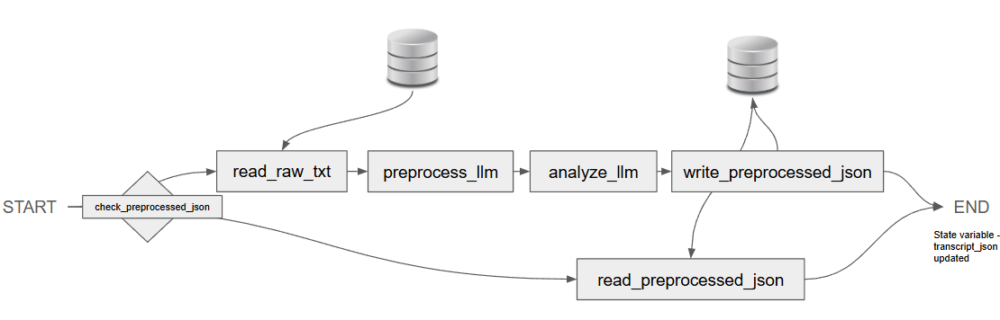

# Agentic AI: Earnings call transcript analyzer

## Introduction

The goal of the agentic tool is to provide asset management analyst a way to quickly assess the emerging 
topics and risks in a portfolio (mutual fund, ETF). 

The solution architecture is to first preprocess the raw earnings call transcript into a structured json with
metadata tagged to each response in the transcript. The preprocessed json is then passed down for further 
analysis where each response will be assigned a sentiment, sentiment summary and risk factor.

## Agent graph

## Run the analyzer app

Streamlit is choice of app for user interaction with the analyzer. To run the app locally, run 
`streamlit run app.py` inside folder `src`

Select from the stock, year and quarter dropdowns. If the preprocessed json (contains the LLM generated 
sentiment and risk analysis) of the selected stock is not available, the agentic workflow will run to 
preprocess and analyze from the raw transcript text. See the agent workflow graph above. Therefore, the
user might encounter long wait time if the preprocessed json is not already available.

## What do the analyzer app show?

1. Show basic statistics of number of response of different sentiment and risk mentioned
2. A chatbot that allows user ask any questions from the transcript. Instead of using RAG, the transcript
and the user query are both processed in-context. To mitigate context-stuffing (loss of accuracy due to
   long input), further filters are provided to further trim down the json for the chatbot to consider
   when answering user's questions.
   
3. Summarizing the processed transcript in a table for user referencing specific content from the transcript

## Instructions
- To load the virtual environment: `source venv/Scripts/activate`
- To set env variable `GOOGLE_API_KEY`, go to `config` and run `source set_api_key.sh`  
- To run the app locally, go to `/src` and run `streamlit run app.py`
- To create a docker image: `docker build -t earning_call_agent .`
- To run a docker container: `docker run -p 8501:8501 -e GOOGLE_API_KEY=$GOOGLE_API_KEY 
  earning_call_agent`. Since no API KEY info is included in the docker image, the
  API KEY will remain local and be manually passed on when running a docker container

