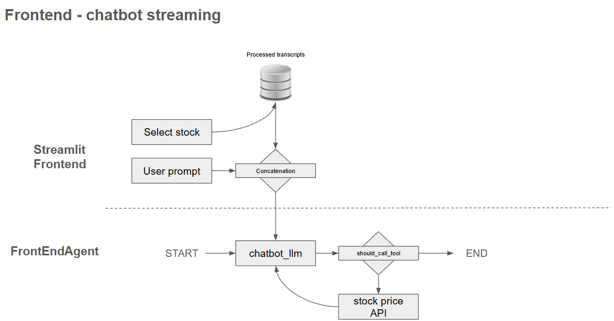

# Agentic AI: Earnings call transcript chatbot

## Introduction

The goal of the agentic chatbot is to provide asset management analyst a way to summarize topics mentioned
in an earnings call. The consolidation of topics and emerging risks mentioned is useful when assessing the 
risks of a portfolio (mutual fund, ETF), which is critical in order to ensure product risk is aligned with
customer KYC (risk tolerence, exposure etc).

### Design philosophy

Essentially, this is a chatbot that provides a summary of what the user want to know based on a company
earnings call. Instead of using a RAG, we use in-context information retrieval. The biggest advantage is 
the ease of implementation and require less fine-tuning, which is typically required for a performant RAG.
Also, in-context chatbot tends to have lower latency due to less LLM (just one) used. The shortcoming of
in-context retrieval compared to RAG is the limitation of the context window and the risk of 
context window stuffing, i.e. chatbot becomes less aware of the content as the size of the input increases.

To get around this issue, we developed a backend preprocessing agent to progressingly structure the earning 
transcripts as much as possible. For example, tagging with metadata, splitting statements into logical 
sub-statements with coherent theme and sentiment, and summarizing a statement into one sentence that explain 
the sentiment of the statement. All these preprocessings allow the frontend chatbot agent to answer questions 
much more effectively as answer is generated based on a list of condensed sentences instead of the full 
transcript.

Separating the backend preprocessing agent from the frontend chatbot improves response time and therefore
user experience. The preprocessed transcripts are further persisted, removing the need to run the
extraction and preprocessing everytime.

## Agent graph

### Backend agent
- Run this to extract and process all the stocks you want to analyze their earnings call transcripts
- Once run, the preprocessed json will be saved under `/data/processed`. The app will only populate the
filter for those in the folder

### Frontend agent 
- An agentic chatbot answering user's question based on the processed earning call statements of the selected
  stock. The agentic chatbot can call stock price API if necessary to answer user's query.

### Overall agent workflow

## Run the chatbot (frontend) app

Streamlit is choice of app for user interaction with the analyzer. To run the app locally, run 
`streamlit run app.py` inside folder `src`

Select from the stock, year and quarter dropdowns. If the preprocessed json (contains the LLM generated 
sentiment and risk analysis) of the selected stock is not available, the agentic workflow will run to 
preprocess and analyze from the raw transcript text. See the agent workflow graph above. Therefore, the
user might encounter long wait time if the preprocessed json is not already available.

## How to use the chatbot?

The chatbot that allows user ask any questions from the transcript. Instead of using RAG, the transcript
and the user query are both processed in-context. To mitigate context-stuffing (loss of accuracy due to
long input), further filters are provided to further trim down the json for the chatbot to consider
when answering user's questions.

Some questions the user might consider asking:
- summarize the main themes mentioned in the responses. Return
  1. number of themes
  2. name and short description of each theme
  3. compare with the stock performance over the same period
  
Note that the LLM (gemini-2.5-flash) has a tendency to avoid responses that involve forecasting stock 
return. Therefore, if one wants the agent to call the stock price API tool, try using backward-looking 
words such as '*compare with*' instead of words with forward-looking connotation such as '*correlate with*'. 
The chatbot system prompt is already designed to mitigate LLM failing to call the price tool. Test case
`test_tool_call` is built to test this.

   
## Instructions
- To load the virtual environment: `source venv/Scripts/activate`
- To set env variable `GOOGLE_API_KEY`, go to `config` and run `source set_api_key.sh`  
- To run the app locally, go to root directory and run `python -m streamlit run src/app.py`
- To create a docker image: `docker build -t earning_call_agent .`
- To run a docker container: `docker run -p 8501:8501 -e GOOGLE_API_KEY=$GOOGLE_API_KEY 
  earning_call_agent`. Since no API KEY info is included in the docker image, the
  API KEY will remain local and be manually passed on when running a docker container
- To run a docker container on another machine:
    - tag the image: `docker tag earning_call_agent dockerhub_username/earning_call_agent:latest`
    - log in to docker hub: `docker login`
    - push the image: `docker push dockerhub_username/earning_call_agent:latest`
    - on another machine, pull the image: `docker pull dockerhub/earning_call_agent:latest`
    - run the container: use the *To run a docker container* command above
- To run pytest:
    - go to root directory, run `python -m pytest -v tests/`. Using `python -m`
    avoids using `python` and `pytest` from different locations
- CI/CD:
  - the CI pipeline will be triggered when PR or push to the `main` branch, as specified
  by `.github/workflows/ci.yml`. The CI pipeline has two parts
    - pytest
    - build and push docker image
  - user credentials and API keys are saved under *Actions secrets and variables* on Github
- To build a container from the Docker image on Docker Desktop:
  - set host port to `8501`
  - in environment variable, set the value for `GOOGLE_API_KEY`
- To run eval:
  - **Langsmith** is used to trace and evaluate the agent. Since langchain/langgraph is the main tech stack,
  one only need to load the langsmith environment variables before running `evaluations/eval.py`. As long as
  the function `evaluate()` is called, tracing is triggered and results can be assessed from the langsmith
  web UI  

## Looking ahead for speedbumps
- Langchain has relatively high latency due to abstraction. Therefore it is more suitable for prototyping
rather than production
- while using LLM API directly reduces latency compared with langchain `init_chat_model()`, tracer wrappers
will be needed for tracing using Langsmith, and hence more refactoring to be done